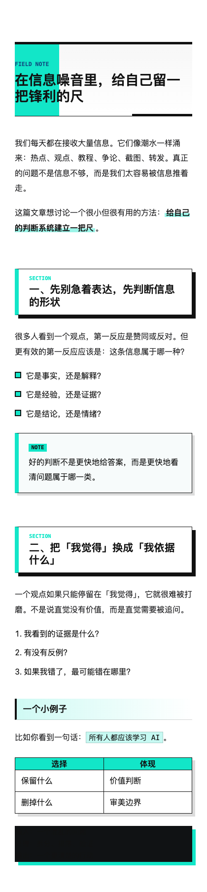
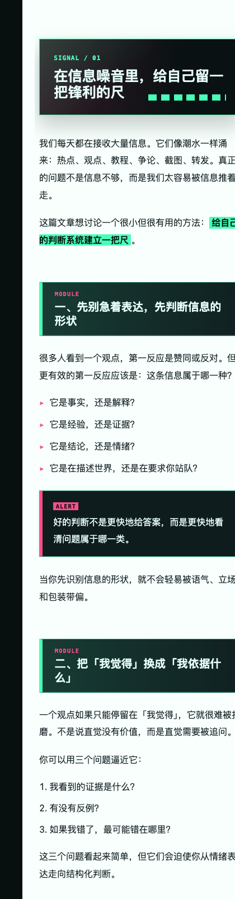
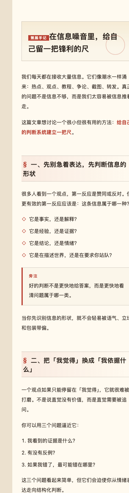
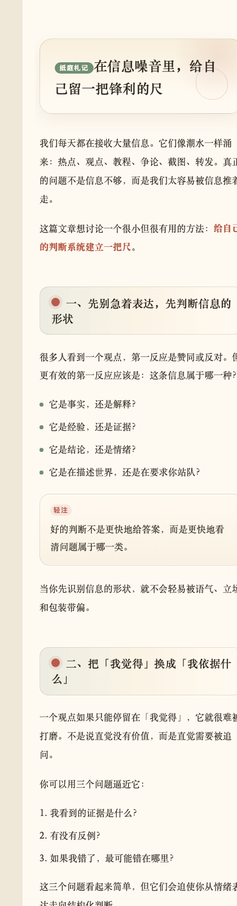

# WeChat Article Themes

Three opinionated CSS themes for WeChat Official Account Markdown articles.

三套适合微信公众号 Markdown 排版的独立 CSS 主题。目标不是“换个颜色”，而是提供可以被读者一眼识别的文章视觉系统。

These themes were designed for articles that should feel recognizable at a glance instead of looking like another generic public-account template. They work best with Markdown-to-WeChat editors that let you paste or configure custom CSS, such as doocs/md, mdnice-style workflows, or your own renderer.

## Themes

### Edge Note / 锐稿

A sharp editorial system: black-and-white contrast, cyan signal marks, hard-edged headings, annotation-like quote blocks.



### Signal Lab / 信标

A technical interface system: dark modules, neon green and magenta accents, compact signal labels, lab-note energy.



### Paper Museum / 纸馆

A curated paper system: warm paper background, red seal marks, calm spacing, museum-note rhythm.



### Paper Garden / 纸庭

A softer paper system: rounded note blocks, serif-first Chinese typography, muted garden green, and gentle cinnabar marks.



## Files

```text
themes/
  edge-note.css
  signal-lab.css
  paper-museum.css
  paper-garden.css
examples/
  sample.md
previews/
  edge-note.png
  signal-lab.png
  paper-museum.png
  paper-garden.png
demo/
  index.html
```

## Usage

## 使用方式

### doocs/md

1. Open the editor.
2. Open the custom CSS panel.
3. Paste one file from `themes/`.
4. Write with normal Markdown.
5. Copy the rendered article into the WeChat Official Account editor.

中文步骤：

1. 打开支持自定义 CSS 的公众号 Markdown 编辑器。
2. 进入自定义 CSS / 主题样式区域。
3. 复制 `themes/` 里的任意一个 CSS 文件。
4. 使用普通 Markdown 写作。
5. 将渲染结果复制到微信公众号后台。

### Generic Markdown Renderer

Wrap rendered Markdown in a container and load one theme CSS file:

```html
<article id="output">
  <section>
    <!-- rendered markdown -->
  </section>
</article>
<link rel="stylesheet" href="./themes/edge-note.css">
```

The themes assume these CSS variables exist:

```css
:root {
  --md-primary-color: #0F4C81;
  --md-font-family: -apple-system-font, BlinkMacSystemFont, "Helvetica Neue", "PingFang SC", "Microsoft YaHei", Arial, sans-serif;
  --md-font-size: 16px;
}
```

## Design Notes

- The themes intentionally avoid generic rounded-card pastel layouts.
- Each theme has its own visual memory: signal bars, lab modules, paper seals, editorial marks.
- The CSS focuses on common article elements: headings, paragraphs, emphasis, lists, quotes, code, tables, images, and alert blocks.
- Some selectors follow doocs/md conventions, such as `.codespan`, `.code__pre`, `.markdown-alert`, and `.md-figcaption`.

## License

MIT
