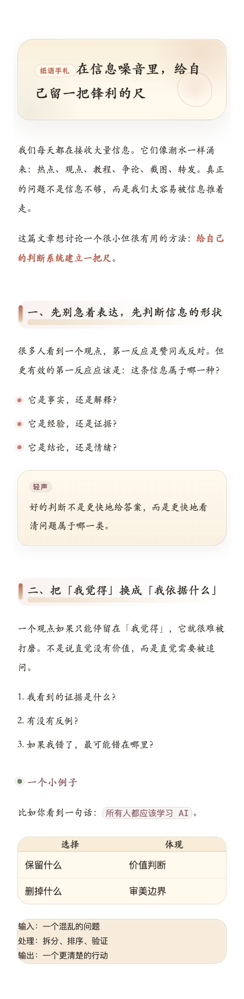

# 微信公众号排版主题包

让 Markdown 文章一键变成有风格的公众号排版。

如果你不知道 CSS，也没关系。这个仓库就是给你准备的：选一个喜欢的主题，复制到支持“自定义 CSS”的公众号 Markdown 编辑器里，就能直接用。

## 第一次来？先看这里

你只需要记住一句话：

> 这个仓库提供公众号 Markdown 排版 CSS。复制 `themes/` 里的一个 CSS 文件，粘贴到公众号 Markdown 编辑器的自定义 CSS 区域。

最快入口：

| 你是谁 | 直接做什么 |
| --- | --- |
| 完全不懂代码 | 打开 [START_HERE.md](./START_HERE.md)，照着 3 分钟教程做 |
| 想让 Codex / Claude / Cursor 帮你 | 复制 [prompts/agent-install.txt](./prompts/agent-install.txt) 里的话发给 agent |
| 会运行命令 | `git clone` 后执行 `./install.sh` |

最推荐新手先用：

[themes/paper-garden.css](./themes/paper-garden.css)

想要更温润、更有纸本手札气质，可以用：

[themes/paper-whisper.css](./themes/paper-whisper.css)

## 这个仓库是干什么的？

这是一个 **微信公众号文章排版 CSS 主题包**。

你可以把它理解成公众号文章的“皮肤”：

- 写文章：继续用 Markdown
- 换风格：复制一个 CSS 主题
- 发公众号：把渲染结果复制到微信公众平台

适合：

- 想让公众号排版更有辨识度的人
- 不想每篇文章手动调字号、标题、引用块的人
- 想让 Codex、Claude、Cursor 这类 agent 帮自己安装/接入主题的人

## 30 秒上手

最简单的方式：

1. 打开一个支持自定义 CSS 的 Markdown 公众号编辑器，例如 [doocs/md](https://md.doocs.org)
2. 在本仓库打开 `themes/`
3. 选择一个主题文件，例如 `paper-garden.css`
4. 复制整个 CSS 内容
5. 粘贴到编辑器的“自定义 CSS / 主题样式”里
6. 写 Markdown，复制排版结果到微信公众号后台

不知道选哪个？先用：

[themes/paper-garden.css](./themes/paper-garden.css)

它是最柔和、最适合普通文章阅读的一套。

如果你喜欢 `Paper Museum / 纸馆` 的纸本和红章气质，但希望它更温润、更少硬边框，可以试试：

[themes/paper-whisper.css](./themes/paper-whisper.css)

## 让 Agent 帮你安装

你可以直接对 Codex、Claude、Cursor 这类 agent 说：

```text
请帮我安装这个仓库里的微信公众号排版主题：
https://github.com/openfield-mind/wechat-article-themes

要求：
1. 克隆仓库
2. 阅读 AGENTS.md
3. 把 themes 里的 CSS 安装到我当前项目合适的位置
4. 告诉我如何在编辑器里使用
```

更完整的可复制版本在：

```text
prompts/agent-install.txt
```

如果你已经在本地，可以说：

```text
请读取 /path/to/wechat-article-themes/AGENTS.md，
把 paper-garden.css 接入我当前的公众号 Markdown 编辑器项目。
```

## 一键下载安装到本机

如果你会运行命令，可以执行：

```sh
git clone https://github.com/openfield-mind/wechat-article-themes.git
cd wechat-article-themes
./install.sh
```

安装后会复制到：

```text
~/wechat-article-themes/
```

你可以从这里打开和复制主题：

```text
~/wechat-article-themes/themes/
```

## 主题预览

### Paper Garden / 纸庭

柔和纸本风。圆角卡片、宋体/衬线字体、草木绿和朱砂点缀，适合随笔、知识类、人文类公众号。

推荐新手先用这一套。


### Paper Whisper / 纸语

温润手札风。保留纸本、红章、旁注的文化气质，但把硬边框换成软纸边、手写感宋楷字体和更轻的暖色阴影，适合散文、读书笔记、个人表达。



### Paper Museum / 纸馆

策展手记风。纸张、红章、旁注、展签感更强，适合审美类、读书类、文化类内容。


### Edge Note / 锐稿

锋利编辑部风。黑白高对比、荧光青标记、硬边框标题，适合观点文、评论、方法论。


### Signal Lab / 信标

实验室界面风。深色模块、荧光绿和洋红信号点，适合 AI、技术、产品、研究笔记。


## 文件说明

```text
themes/                 主题 CSS，真正要复制/安装的是这里
  paper-garden.css      柔和纸本风，推荐新手
  paper-whisper.css     温润手札风，柔和纸馆系
  paper-museum.css      策展纸本文艺风
  edge-note.css         锋利编辑部风
  signal-lab.css        科技实验室风

previews/               每套主题的效果图
examples/sample.md      示例 Markdown 文章
demo/index.html         本地预览页面，双击即可打开
START_HERE.md           第一次使用只看这一页
AGENTS.md               给 Codex/Claude/Cursor 等 agent 的安装说明
QUICKSTART.md           更详细的新手教程
prompts/                可以复制给 agent 的提示词
scripts/                重新生成主题预览图的脚本
install.sh              本机安装脚本
```

## 本地预览

下载仓库后，直接双击打开：

```text
demo/index.html
```

页面顶部可以切换 5 套主题。

## 常见问题

### 我不会 CSS，可以用吗？

可以。你只需要复制 `themes/` 里的一个 CSS 文件，然后粘贴到编辑器的自定义 CSS 区域。

### 它能直接发布到公众号吗？

这个仓库只提供排版主题。你仍然需要用 doocs/md、mdnice 等编辑器把 Markdown 渲染成微信公众号可粘贴的内容。

### 推荐哪套？

新手先用 `paper-garden.css`。它最柔和，适合大多数文章。

### 可以修改颜色和字体吗？

可以。每个 CSS 文件顶部都有一组变量，例如：

```css
:root {
  --paper-garden-green: #6f8f73;
  --paper-garden-red: #b75b4a;
}
```

改这些变量就能调整主色。

## License

MIT
